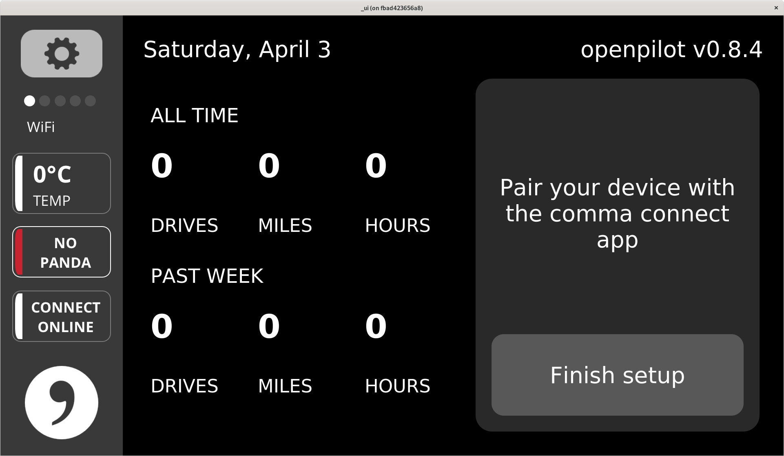

# dockerpilot

Build OpenPilot in a docker container with more ease, at the expense of time, and without depending on commaai's base image.

# Caveats

* The container is currently configured to build only the master branch of the official openpilot repo.

* The container **does not** pass webcams through as-is. **Modify `run.sh` to pass through USB devices such as panda and webcams!**

* You must be in the docker group.

## Requirements

* CUDA Capable GPU
* nVidia Proprietary Drivers
* nvidia-container-runtime
    - https://github.com/NVIDIA/nvidia-container-runtime

### Test

To see if you can run a cuda accelerated container run the following.
```
docker run -it --rm --gpus all nvidia/cuda nvidia-smi -L
```

If the container can access the GPU output such as the following will be shown:
```
GPU 0: GeForce 840M (UUID: GPU-89ec8158-10c8-fb8d-eafa-19d9f1e9b1a0)
```

##  Use
```
$ git clone https://github.com/Smurf/dockerpilot.git
$ cd dockerpilot
$ git clone https://github.com/commaai/openpilot.git
$ ./build-all.sh #This may take 3+ hours depending on CPU
$ ./run.sh
```

# Screenshots



